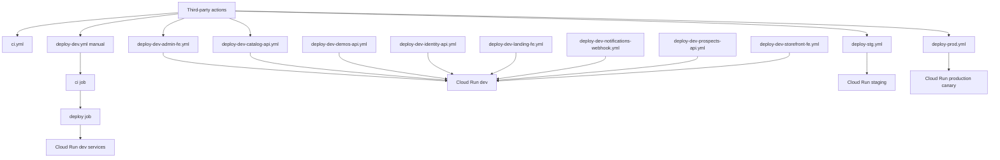
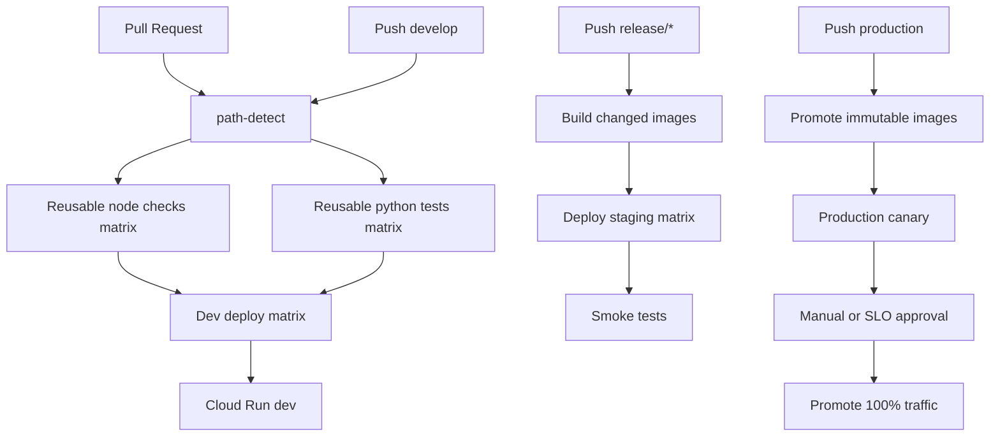

# GitHub Actions and CI/CD Audit

Audit date: 2026-06-04

Remediation note: this report records the audit baseline found before the CI/CD remediation changes in this PR. The PR addresses several findings directly, including workflow concurrency, path-aware CI, backend test parallelization, Docker Buildx caching, production auto-promotion, PAT cleanup, blocking lint, and the stray npm lockfile.

## Executive Summary

Overall risk assessment: Medium.

The repository is a pnpm monorepo with eight deployable Cloud Run services, shared TypeScript packages, Python FastAPI services, Dockerfiles, Terraform infrastructure, Cloud Build configuration, and local Kubernetes manifests. The CI/CD estate is functional and uses GitHub OIDC for GCP authentication, which is a strong baseline. The largest opportunities are reducing duplicate workflow code, adding concurrency cancellation, parallelizing build/deploy work, adopting Docker layer caching, and improving security controls around branch-triggered deployments and public Cloud Run exposure.

Critical findings: None confirmed from repository evidence.

Important findings:

- Production deployment is push-triggered from the `production` branch and promotes canaries automatically after a fixed five-minute sleep without an explicit manual approval step inside the workflow.
- No workflow defines `concurrency`, so repeated pushes can run stale deployments and waste runner minutes.
- Staging and production workflows build and deploy multiple applications sequentially in a single job, limiting failure isolation and runtime efficiency.
- Backend deploy workflows duplicate nearly identical test, build, push, and Cloud Run deploy logic across five files.
- Docker builds use plain `docker build` without registry-backed or GitHub Actions cache configuration.
- Several Cloud Run services are deployed with `--allow-unauthenticated`; this may be appropriate for public frontends, but APIs need endpoint-level auth controls verified outside workflow files.

Quick wins:

- Add `concurrency` to every CI and deploy workflow.
- Convert backend service deploys to a reusable workflow or matrix.
- Add Buildx with `cache-from` and `cache-to`.
- Add path filters to `ci.yml`.
- Split staging and production deploys into build artifacts plus parallel per-service deployments.
- Replace the fixed production `sleep 300` promotion with environment approvals, health gates, or manual `workflow_dispatch` promotion.

30-day roadmap:

- Standardize workflow structure and naming.
- Introduce reusable `test-python-service`, `build-push-image`, and `deploy-cloud-run` workflows.
- Add concurrency cancellation and path-aware CI.
- Add Docker layer caching and pnpm/uv cache strategy.
- Document Cloud Run ingress/auth expectations per service.

90-day roadmap:

- Move deployment topology into a reusable matrix architecture.
- Add artifact/image promotion from staging to production instead of rebuilding in each environment.
- Add security scanning for containers and dependencies.
- Add Terraform plan/apply CI with environment approvals.
- Add SLO-based smoke tests and automated rollback guidance for canaries.

## 1. Workflow Inventory

| Workflow Name | File | Trigger | Purpose | Environment |
|---|---|---|---|---|
| CI | `.github/workflows/ci.yml` | `pull_request` to `develop`, `release/*`; `push` to `develop` | Typecheck core, run core tests, run backend tests, lint | CI |
| Deploy Dev - admin-fe | `.github/workflows/deploy-dev-admin-fe.yml` | `push` to `develop` with path filters | Build and deploy admin frontend | dev |
| Deploy Dev - catalog-api | `.github/workflows/deploy-dev-catalog-api.yml` | `push` to `develop` with path filters | Test, build, and deploy catalog API | dev |
| Deploy Dev - demos-api | `.github/workflows/deploy-dev-demos-api.yml` | `push` to `develop` with path filters | Test, build, and deploy demos API | dev |
| Deploy Dev - identity-api | `.github/workflows/deploy-dev-identity-api.yml` | `push` to `develop` with path filters | Test, build, and deploy identity API | dev |
| Deploy Dev - landing-fe | `.github/workflows/deploy-dev-landing-fe.yml` | `push` to `develop` with path filters | Build and deploy landing frontend | dev |
| Deploy Dev - notifications-webhook | `.github/workflows/deploy-dev-notifications-webhook.yml` | `push` to `develop` with path filters | Test, build, and deploy notifications webhook | dev |
| Deploy Dev - prospects-api | `.github/workflows/deploy-dev-prospects-api.yml` | `push` to `develop` with path filters | Test, build, and deploy prospects API | dev |
| Deploy Dev - storefront-fe | `.github/workflows/deploy-dev-storefront-fe.yml` | `push` to `develop` with path filters | Build and deploy storefront frontend | dev |
| Deploy Dev - all services | `.github/workflows/deploy-dev.yml` | `workflow_dispatch` | Manual full dev CI and deployment | dev |
| Deploy - Stg | `.github/workflows/deploy-stg.yml` | `push` to `release/**` with path filters | Build and deploy selected staging services | staging |
| Deploy - Prod | `.github/workflows/deploy-prod.yml` | `push` to `production` with path filters | Build and canary deploy selected production services | production |

No `release`, `schedule`, tag-based, or `workflow_call` triggers were found in `.github/workflows`.

## 2. Workflow Dependency Analysis

Reusable workflows: none detected. No workflow declares `workflow_call`.

Composite/local actions: none detected. No local `.github/actions` directory was found in the inspected workflow paths.

Third-party actions:

| Action | Usage | Evidence |
|---|---|---|
| `actions/checkout@v4` | Source checkout | `.github/workflows/ci.yml:16`, `.github/workflows/deploy-dev.yml:20` |
| `pnpm/action-setup@v4` | pnpm setup | `.github/workflows/ci.yml:17`, `.github/workflows/deploy-dev-storefront-fe.yml:40` |
| `actions/setup-node@v4` | Node setup and pnpm cache | `.github/workflows/ci.yml:18`, `.github/workflows/deploy-dev-admin-fe.yml:43` |
| `astral-sh/setup-uv@v5` | uv setup for Python services | `.github/workflows/ci.yml:23`, `.github/workflows/deploy-dev-catalog-api.yml:35` |
| `google-github-actions/auth@v2` | GCP OIDC auth | `.github/workflows/deploy-prod.yml:38`, `.github/workflows/deploy-stg.yml:38` |
| `google-github-actions/setup-gcloud@v2` | gcloud install | `.github/workflows/deploy-prod.yml:43`, `.github/workflows/deploy-stg.yml:43` |

Dependency diagram:



## 3. Monorepo Structure Analysis

This repository is a monorepo. Evidence: root `pnpm-workspace.yaml` includes `apps/*` and `packages/*`, while root `package.json` declares the workspace package manager.

| Area | Path | Classification | Evidence |
|---|---|---|---|
| Admin frontend | `apps/admin-fe` | Frontend application, Vite/React | `apps/admin-fe/package.json:7`, `apps/admin-fe/Dockerfile:53` |
| Storefront frontend | `apps/storefront-fe` | Frontend application, Next.js | `apps/storefront-fe/package.json:6`, `apps/storefront-fe/Dockerfile:43` |
| Landing frontend | `apps/landing-fe` | Frontend application, Next.js | `apps/landing-fe/package.json:6`, `apps/landing-fe/Dockerfile:26` |
| Catalog API | `apps/catalog-api` | Backend API, FastAPI/Python | `apps/catalog-api/pyproject.toml:5`, `apps/catalog-api/Dockerfile:38` |
| Identity API | `apps/identity-api` | Backend API, FastAPI/Python | `apps/identity-api/pyproject.toml:5`, `apps/identity-api/Dockerfile:38` |
| Demos API | `apps/demos-api` | Backend API, FastAPI/Python | `apps/demos-api/pyproject.toml:5`, `apps/demos-api/Dockerfile:38` |
| Prospects API | `apps/prospects-api` | Backend API, FastAPI/Python | `apps/prospects-api/pyproject.toml:5`, `apps/prospects-api/Dockerfile:38` |
| Notifications webhook | `apps/notifications-webhook` | Worker/webhook API | `apps/notifications-webhook/pyproject.toml:5`, `.github/workflows/deploy-dev-notifications-webhook.yml:78` |
| Shared auth package | `packages/auth` | Internal package | `packages/auth/package.json:1` |
| Shared client package | `packages/client` | Internal package | `packages/client/package.json:1` |
| Shared core package | `packages/core` | Internal package | `packages/core/package.json:1` |
| Shared UI package | `packages/ui` | Internal package | `packages/ui/package.json:1` |
| Terraform | `infrastructure/iterraform` | Infrastructure modules and app stacks | `infrastructure/iterraform/modules/cloud_run/main.tf` |
| Cloud Build | `infrastructure/cloudbuild` | GCP build/deploy pipeline | `infrastructure/cloudbuild/deploy-app.yaml:1` |
| Kubernetes | `infrastructure/k8s` | Local/kind Kubernetes manifests | `infrastructure/k8s/admin-deployment.yaml:1` |

## 4. Trigger Analysis

| Workflow | Branches | Path Filters | Trigger Assessment |
|---|---|---|---|
| `ci.yml` | `develop`, PRs to `develop` and `release/*` | None | Runs for any push to `develop`, including docs or infra-only changes. |
| `deploy-dev-*.yml` | `develop` | Yes | Reasonably scoped per application; shared package changes trigger frontend deploys where relevant. |
| `deploy-dev.yml` | Manual only | N/A | Useful for full dev redeploys; no accidental trigger risk. |
| `deploy-stg.yml` | `release/**` | Yes | Path filters exist, but one job deploys multiple services even when only one path changes. |
| `deploy-prod.yml` | `production` | Yes | Path filters exist, but production is deployed automatically on branch push. |

Finding: CI runs on unrelated changes

- Description: `ci.yml` has branch filters but no path filters. Documentation-only or isolated infrastructure changes on `develop` will run full JS/Python installation and tests.
- Evidence: `.github/workflows/ci.yml:3`, `.github/workflows/ci.yml:6`, `.github/workflows/ci.yml:24`, `.github/workflows/ci.yml:32`
- Risk Level: Low
- Recommendation: Add path filters or a path-detection job that skips service test suites when irrelevant files change.
- Expected Impact: Low to medium runner-minute reduction depending on doc/infra churn.

Finding: Staging and production path filters still trigger broad deploys

- Description: `deploy-stg.yml` and `deploy-prod.yml` listen to many app paths but deploy multiple services from a single job after any matching change.
- Evidence: `.github/workflows/deploy-stg.yml:6`, `.github/workflows/deploy-stg.yml:46`, `.github/workflows/deploy-stg.yml:61`, `.github/workflows/deploy-stg.yml:83`; `.github/workflows/deploy-prod.yml:6`, `.github/workflows/deploy-prod.yml:46`
- Risk Level: Medium
- Recommendation: Use path detection plus a matrix to build and deploy only affected services, while preserving dependency-triggered redeploys for frontends that consume changed shared packages.
- Expected Impact: Medium to high runtime and deployment-risk reduction.

## 5. Cost and Efficiency Analysis

Finding: No concurrency cancellation

- Description: No workflow defines `concurrency`, so multiple commits to the same branch can run obsolete CI or deploy runs.
- Evidence: repository-wide search found no `concurrency:` entries in `.github/workflows`.
- Risk Level: Medium
- Recommendation: Add `concurrency: { group: ${{ github.workflow }}-${{ github.ref }}, cancel-in-progress: true }` to CI and non-production deploys. For production, use a non-canceling deployment queue or environment protection depending on release policy.
- Expected Impact: Medium cost reduction and lower stale deployment risk.

Finding: Repeated dependency installation

- Description: Dev deploy workflows run full `pnpm install` before frontend typechecks, and Dockerfiles also install dependencies during image builds.
- Evidence: `.github/workflows/deploy-dev-admin-fe.yml:47`, `.github/workflows/deploy-dev-storefront-fe.yml:45`, `apps/admin-fe/Dockerfile:15`, `apps/storefront-fe/Dockerfile:13`
- Risk Level: Low
- Recommendation: Use filtered installs in CI (`pnpm install --filter admin-fe... --frozen-lockfile`) and reuse build artifacts where possible.
- Expected Impact: Low to medium runtime reduction.

Finding: Sequential staging and production builds

- Description: Staging and production workflows build multiple Docker images sequentially inside one job.
- Evidence: `.github/workflows/deploy-stg.yml:46`, `.github/workflows/deploy-stg.yml:61`, `.github/workflows/deploy-stg.yml:83`, `.github/workflows/deploy-stg.yml:105`; `.github/workflows/deploy-prod.yml:46`, `.github/workflows/deploy-prod.yml:55`, `.github/workflows/deploy-prod.yml:59`, `.github/workflows/deploy-prod.yml:69`
- Risk Level: Medium
- Recommendation: Split build jobs by service with a matrix and use deploy jobs that depend only on required images.
- Expected Impact: High runtime reduction for multi-service releases.

## 6. Security Audit

Positive controls:

- Deploy workflows use GitHub OIDC through `google-github-actions/auth@v2` and grant `id-token: write` plus `contents: read`, which is an appropriate minimum for WIF-based deploys.
- Backend Dockerfiles mount `GH_PAT` as a BuildKit secret instead of passing it as a normal build argument.
- Production SMTP password is passed to Cloud Run via Secret Manager.

Finding: CI uses a PAT in global git config

- Description: CI and backend deploy tests configure a global GitHub URL rewrite containing `GH_PAT`. GitHub masks secrets in logs, but global config can leak into subsequent steps in the same job if later commands print config or run untrusted scripts.
- Evidence: `.github/workflows/ci.yml:26`, `.github/workflows/ci.yml:28`; `.github/workflows/deploy-dev-catalog-api.yml:39`, `.github/workflows/deploy-dev-catalog-api.yml:43`
- Risk Level: Medium
- Recommendation: Prefer `uv`/pip auth mechanisms scoped to the install command, or remove the rewrite after installation with `git config --global --unset-all`.
- Expected Impact: Reduced credential exposure blast radius.

Finding: Production canary promotes automatically after a fixed wait

- Description: Production deploy sends 10% traffic to canary, waits five minutes, and promotes to 100% without an explicit health gate shown in the workflow.
- Evidence: `.github/workflows/deploy-prod.yml:80`, `.github/workflows/deploy-prod.yml:89`, `.github/workflows/deploy-prod.yml:109`, `.github/workflows/deploy-prod.yml:114`
- Risk Level: High
- Recommendation: Add manual environment approval, automated SLO checks, smoke tests, and rollback criteria before full promotion.
- Expected Impact: Lower production incident risk.

Finding: Public Cloud Run exposure should be service-specific

- Description: Many services use `--allow-unauthenticated`. This is expected for public frontends, but backend APIs should be public only if app-level auth and rate limits are mandatory and verified.
- Evidence: `.github/workflows/deploy-dev-catalog-api.yml:78`, `.github/workflows/deploy-dev-storefront-fe.yml:86`, `.github/workflows/deploy-stg.yml:59`, `.github/workflows/deploy-prod.yml:88`
- Risk Level: Medium
- Recommendation: Document intended exposure per service and use `--no-allow-unauthenticated` for internal/webhook-only services. Keep API endpoints protected by Firebase/IAM/auth middleware.
- Expected Impact: Reduced public attack surface.

Finding: Actions are version-pinned by tag, not immutable SHA

- Description: Third-party actions use version tags such as `@v4` and `@v2`. This is common, but not the strongest supply-chain posture.
- Evidence: `.github/workflows/ci.yml:16`, `.github/workflows/ci.yml:23`, `.github/workflows/deploy-prod.yml:38`
- Risk Level: Low
- Recommendation: Pin critical actions to full SHAs, especially deploy/auth actions, and use Dependabot to update them.
- Expected Impact: Better supply-chain integrity.

Finding: GCP setup grants broad IAM roles

- Description: The one-time setup script grants roles such as billing admin, storage admin, and Cloud Build editor to a service account. This may be necessary for bootstrap, but it exceeds normal runtime/deploy least privilege.
- Evidence: `infrastructure/gcp/setup.sh:30`, `infrastructure/gcp/setup.sh:35`, `infrastructure/gcp/setup.sh:40`, `infrastructure/gcp/setup.sh:45`
- Risk Level: Medium
- Recommendation: Split bootstrap, deploy, and runtime service accounts. Remove bootstrap roles after initial project provisioning.
- Expected Impact: Reduced cloud privilege escalation surface.

## 7. Node.js and Toolchain Audit

| Tool | Current State | Evidence | Assessment |
|---|---|---|---|
| Node.js | Workflows and Dockerfiles use Node 20 | `.github/workflows/ci.yml:20`, `apps/admin-fe/Dockerfile:1` | Consistent but conservative. |
| pnpm | Root uses `pnpm@9.0.0` | `package.json:4`, `pnpm-workspace.yaml:1` | Consistent at root. |
| npm | `apps/storefront-fe/package-lock.json` exists | `apps/storefront-fe/package-lock.json` | Inconsistent lockfile in pnpm workspace. |
| Python | Backend services require Python 3.13 | `apps/catalog-api/pyproject.toml:9`, `.github/workflows/ci.yml:30` | Consistent for backend services. |
| uv | Workflows use `astral-sh/setup-uv@v5` | `.github/workflows/ci.yml:23` | Good, but uv cache is not explicitly configured. |

Finding: Mixed JS lockfiles

- Description: The repository is pnpm-based, but `apps/storefront-fe/package-lock.json` exists. This can confuse automation and developers.
- Evidence: `package.json:4`, `pnpm-workspace.yaml:1`, `apps/storefront-fe/package-lock.json`
- Risk Level: Low
- Recommendation: Remove or ignore npm lockfiles from workspace apps unless npm is intentionally supported.
- Expected Impact: Lower dependency drift risk.

Finding: Node 20 despite Node 24 action runtime override

- Description: Workflows set `FORCE_JAVASCRIPT_ACTIONS_TO_NODE24=true`, but app runtime/tooling still uses Node 20.
- Evidence: `.github/workflows/ci.yml:11`, `.github/workflows/ci.yml:20`, `apps/storefront-fe/Dockerfile:1`
- Risk Level: Low
- Recommendation: Decide whether Node 20 is the application runtime standard or upgrade consistently after compatibility testing. Do not rely on the action runtime override as an app runtime policy.
- Expected Impact: Clearer support policy and fewer runtime surprises.

## 8. Performance Audit

Finding: Docker layer caching is missing from GitHub Actions workflows

- Description: Docker builds use `docker build` directly and do not use Buildx cache exporters/importers.
- Evidence: `.github/workflows/deploy-dev-storefront-fe.yml:62`, `.github/workflows/deploy-dev-admin-fe.yml:66`, `.github/workflows/deploy-prod.yml:55`
- Risk Level: Medium
- Recommendation: Adopt `docker/setup-buildx-action` and `docker/build-push-action` with `cache-from: type=gha` and `cache-to: type=gha,mode=max`, or registry cache in Artifact Registry.
- Expected Impact: Medium to high runtime reduction for repeated builds.

Finding: Backend tests run serially in CI

- Description: `ci.yml` loops through backend services in a single step. Failures are slower to isolate, and services cannot run in parallel.
- Evidence: `.github/workflows/ci.yml:39`, `.github/workflows/ci.yml:40`
- Risk Level: Low
- Recommendation: Convert backend tests to a matrix over service names.
- Expected Impact: Medium CI runtime reduction for backend-heavy changes.

Finding: Lint is allowed to fail

- Description: CI runs lint with `continue-on-error: true`, so lint failures do not block merges.
- Evidence: `.github/workflows/ci.yml:43`, `.github/workflows/ci.yml:45`
- Risk Level: Low
- Recommendation: Either make lint blocking or label it as advisory in a separate job. If current lint debt is high, add a scoped lint baseline.
- Expected Impact: Better code-quality signal.

Estimated runtime reduction from target architecture: 50-70% for common changes that touch one service, driven by path-aware CI, matrix builds, Docker caching, and cancellation of stale runs.

## 9. Deployment Audit

| Application | Workflow | Deployment Target | Deployment Method |
|---|---|---|---|
| admin-fe | `deploy-dev-admin-fe.yml`, `deploy-dev.yml`, `deploy-stg.yml`, `deploy-prod.yml` | Cloud Run | Docker image to Artifact Registry, `gcloud run deploy` |
| storefront-fe | `deploy-dev-storefront-fe.yml`, `deploy-dev.yml`, `deploy-stg.yml`, `deploy-prod.yml` | Cloud Run | Docker image to Artifact Registry, `gcloud run deploy` |
| landing-fe | `deploy-dev-landing-fe.yml`, `deploy-dev.yml`, `deploy-stg.yml` | Cloud Run | Docker image to Artifact Registry, `gcloud run deploy` |
| catalog-api | `deploy-dev-catalog-api.yml`, `deploy-dev.yml`, `deploy-stg.yml`, `deploy-prod.yml` | Cloud Run | Docker image to Artifact Registry, `gcloud run deploy` |
| identity-api | `deploy-dev-identity-api.yml`, `deploy-dev.yml` | Cloud Run | Docker image to Artifact Registry, `gcloud run deploy` |
| demos-api | `deploy-dev-demos-api.yml`, `deploy-dev.yml` | Cloud Run | Docker image to Artifact Registry, `gcloud run deploy` |
| prospects-api | `deploy-dev-prospects-api.yml`, `deploy-dev.yml` | Cloud Run | Docker image to Artifact Registry, `gcloud run deploy` |
| notifications-webhook | `deploy-dev-notifications-webhook.yml`, `deploy-dev.yml` | Cloud Run | Docker image to Artifact Registry, `gcloud run deploy` |
| template app | `infrastructure/cloudbuild/deploy-app.yaml` | Cloud Run | Cloud Build Terraform, Docker build/push, `gcloud run deploy` |
| local admin | `infrastructure/k8s/admin-deployment.yaml` | kind/Kubernetes | Local image, Kubernetes Deployment and Service |

Unclear from repository evidence: whether identity, demos, prospects, notifications, and landing are intentionally excluded from staging/production deploy workflows.

## 10. Best Practices Review

| Area | Classification | Evidence | Notes |
|---|---|---|---|
| OIDC/WIF auth | Good | `.github/workflows/deploy-prod.yml:30`, `.github/workflows/deploy-prod.yml:38` | Avoids static GCP keys. |
| Explicit permissions | Good | `.github/workflows/deploy-stg.yml:30` | Deploy jobs scope token permissions. |
| Path filters on deploys | Good | `.github/workflows/deploy-dev-storefront-fe.yml:6` | Dev deploys are well scoped. |
| Reusable workflows | Needs Improvement | no `workflow_call` detected | Significant duplication exists. |
| Concurrency controls | Needs Improvement | no `concurrency:` detected | Stale runs can continue. |
| Docker caching | Needs Improvement | `docker build` is used directly | No Buildx/GHA cache. |
| Production promotion | Needs Improvement | `.github/workflows/deploy-prod.yml:109` | Fixed wait is weaker than health gates. |
| Cloud Run exposure | Needs Improvement | multiple `--allow-unauthenticated` flags | Requires service-level intent documentation. |
| Bootstrap IAM | Needs Improvement | `infrastructure/gcp/setup.sh:35`, `infrastructure/gcp/setup.sh:45` | Broad roles should be temporary. |

## 11. Refactoring Opportunities

Duplicate backend deploy logic:

- Evidence: `.github/workflows/deploy-dev-catalog-api.yml:37`, `.github/workflows/deploy-dev-demos-api.yml:37`, `.github/workflows/deploy-dev-prospects-api.yml:37`
- Recommendation: Replace five service-specific backend workflows with one reusable workflow or one matrix workflow.

Duplicate frontend setup/build/deploy logic:

- Evidence: `.github/workflows/deploy-dev-admin-fe.yml:42`, `.github/workflows/deploy-dev-storefront-fe.yml:40`, `.github/workflows/deploy-dev-landing-fe.yml:40`
- Recommendation: Use a reusable workflow parameterized by service, image name, Dockerfile, typecheck command, and Cloud Run service name.

Concrete reusable workflow sketch:

```yaml
name: Reusable Cloud Run Deploy

on:
  workflow_call:
    inputs:
      service:
        required: true
        type: string
      image_name:
        required: true
        type: string
      dockerfile:
        required: false
        type: string
      context:
        required: true
        type: string
      cloud_run_service:
        required: true
        type: string
      environment:
        required: true
        type: string
    secrets:
      gh_pat:
        required: false

jobs:
  deploy:
    runs-on: ubuntu-latest
    environment: ${{ inputs.environment }}
    permissions:
      contents: read
      id-token: write
    concurrency:
      group: deploy-${{ inputs.environment }}-${{ inputs.service }}-${{ github.ref }}
      cancel-in-progress: true
    steps:
      - uses: actions/checkout@v4
      - uses: google-github-actions/auth@v2
        with:
          workload_identity_provider: ${{ vars.WIF_PROVIDER }}
          service_account: ${{ vars.DEPLOYER_SA }}
      - uses: google-github-actions/setup-gcloud@v2
      - uses: docker/setup-buildx-action@v3
      - uses: docker/build-push-action@v6
        with:
          context: ${{ inputs.context }}
          file: ${{ inputs.dockerfile }}
          push: true
          tags: ${{ vars.AR_URL }}/${{ inputs.image_name }}:${{ github.sha }}
          cache-from: type=gha
          cache-to: type=gha,mode=max
```

## 12. Optimized Target Architecture

Recommended workflow structure:

```text
.github/workflows/
  ci.yml
  deploy-dev.yml
  deploy-stg.yml
  deploy-prod.yml
  promote-prod.yml
  reusable-python-test.yml
  reusable-node-check.yml
  reusable-docker-build.yml
  reusable-cloud-run-deploy.yml
```

Workflow hierarchy:



## 13. Monorepo Optimization Plan

Goal: reduce CI/CD execution time by at least 50%.

| Recommendation | Current State | Proposed State | Expected Benefit | Estimated Runtime Reduction |
|---|---|---|---|---|
| Path-aware CI | `ci.yml` runs full suites on every push to `develop` | Detect changed apps/packages and run only impacted checks | Avoids irrelevant work | 20-40% |
| Backend test matrix | Backend services test serially | Matrix per Python service | Parallel test execution | 20-50% for backend CI |
| Service deploy matrix | Stg/prod deploy many services in one job | Matrix build/deploy changed services | Parallelism and isolation | 30-60% |
| Docker layer cache | Plain `docker build` | Buildx with GHA or registry cache | Faster repeated image builds | 20-50% per image |
| Concurrency | No cancellation | Cancel stale non-prod runs | Saves runner minutes | Variable, high during active development |
| Artifact/image promotion | Rebuild per environment | Build once, promote digest | Stronger provenance and faster prod | 15-40% |

Path filter example:

```yaml
on:
  push:
    branches: [develop]
    paths:
      - apps/catalog-api/**
      - packages/**
      - package.json
      - pnpm-lock.yaml
      - .github/workflows/ci.yml
```

Concurrency example:

```yaml
concurrency:
  group: ${{ github.workflow }}-${{ github.ref }}
  cancel-in-progress: true
```

Backend matrix example:

```yaml
strategy:
  fail-fast: false
  matrix:
    service:
      - catalog-api
      - identity-api
      - demos-api
      - prospects-api
      - notifications-webhook
steps:
  - uses: actions/checkout@v4
  - uses: astral-sh/setup-uv@v5
  - run: |
      cd "apps/${{ matrix.service }}"
      uv venv --python 3.13
      uv pip install -e ".[dev]"
      .venv/bin/pytest -q
```

Buildx cache example:

```yaml
- uses: docker/setup-buildx-action@v3
- uses: docker/build-push-action@v6
  with:
    context: .
    file: apps/storefront-fe/Dockerfile
    push: true
    tags: ${{ env.AR_URL }}/catalog-mx-storefront:${{ github.sha }}
    cache-from: type=gha
    cache-to: type=gha,mode=max
```

## 14. Finding Register

| Title | Risk | Evidence | Recommendation | Impact |
|---|---|---|---|---|
| CI runs on unrelated changes | Low | `.github/workflows/ci.yml:6` | Add path-aware CI | Lower runner cost |
| No workflow concurrency | Medium | no `concurrency:` in `.github/workflows` | Add concurrency groups | Prevent stale runs |
| Stg/prod deploy too broadly | Medium | `.github/workflows/deploy-stg.yml:46`, `.github/workflows/deploy-prod.yml:46` | Matrix by changed service | Faster, safer releases |
| Production auto-promotion | High | `.github/workflows/deploy-prod.yml:109` | Add health/approval gate | Lower incident risk |
| Repeated backend deploy logic | Medium | `.github/workflows/deploy-dev-catalog-api.yml:37`, `.github/workflows/deploy-dev-demos-api.yml:37` | Reusable workflow or matrix | Less maintenance drift |
| Missing Docker cache | Medium | `.github/workflows/deploy-prod.yml:55` | Buildx cache | Faster builds |
| PAT stored in git config during jobs | Medium | `.github/workflows/ci.yml:28` | Scope or unset config | Reduced credential risk |
| Public Cloud Run APIs need verification | Medium | `.github/workflows/deploy-dev-catalog-api.yml:78` | Document and restrict service exposure | Smaller attack surface |
| Mixed package lockfiles | Low | `apps/storefront-fe/package-lock.json` | Remove npm lockfile or document npm support | Less dependency confusion |
| Lint is non-blocking | Low | `.github/workflows/ci.yml:45` | Make lint blocking or advisory | Better quality signal |
| Broad bootstrap IAM roles | Medium | `infrastructure/gcp/setup.sh:35`, `infrastructure/gcp/setup.sh:45` | Split temporary bootstrap role | Less cloud privilege risk |
